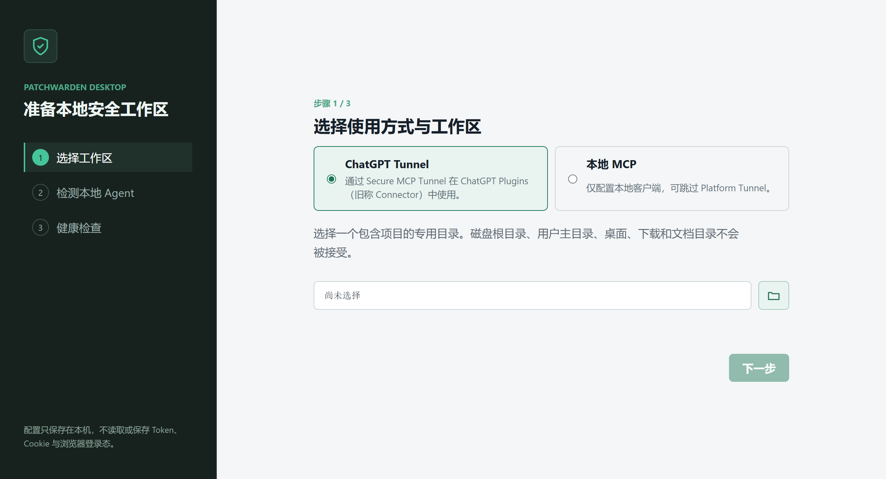

# PatchWarden

<p align="right">
  <a href="./README.md">简体中文</a> · <strong>English</strong>
</p>

[](https://www.npmjs.com/package/patchwarden)
[](https://nodejs.org/)
[](LICENSE)

**Let an MCP client such as ChatGPT or Codex plan and review the work while a local coding agent executes inside explicit safety boundaries and leaves auditable evidence.**

PatchWarden is a local-first MCP safety and verification layer for AI coding
agents, with workspace confinement, command allowlists, scope-violation
detection, and auditable task evidence.

ChatGPT, Codex, OpenCode, or another MCP client can plan and review work.
PatchWarden stores that plan as a workspace-scoped task, lets a preconfigured
local agent execute it, and returns results, diffs, artifact manifests, and
independent verification evidence.

[Download Windows installer v1.6.1](https://github.com/jiezeng2004-design/PatchWarden/releases/download/v1.6.1/PatchWarden-Setup-1.6.1-x64.exe)
· [Portable ZIP](https://github.com/jiezeng2004-design/PatchWarden/releases/download/v1.6.1/PatchWarden-Portable-1.6.1-x64.zip)
· [Checksums](https://github.com/jiezeng2004-design/PatchWarden/releases/download/v1.6.1/PatchWarden-Desktop-SHA256SUMS.txt)
· [Three-minute quick start](#three-minute-quick-start)
· [Discussions](https://github.com/jiezeng2004-design/PatchWarden/discussions)



<sub>Real PatchWarden Desktop first-run UI from a privacy-safe smoke run; no real workspace, account, or credential data is shown.</sub>

Current source version, Windows Release, and npm `latest`: **v1.6.1**. Use the
installer above for the first Windows experience;
pin an actually published version for npm/CLI use. See the
[CHANGELOG](CHANGELOG.md), [migration guide](docs/migration-from-safe-bifrost.md), and
[release checklist](docs/release-checklist.md).

> [!IMPORTANT]
> PatchWarden is not a general-purpose remote shell. MCP clients cannot run
> arbitrary commands: files must remain inside the configured workspace,
> agents must be registered in advance, verification commands must exactly
> match the allowlist, and sensitive paths are blocked.

## Contents

- [What PatchWarden solves](#what-patchwarden-solves)
- [How PatchWarden differs](#how-patchwarden-differs)
- [Evidence example](#evidence-example)
- [Runtime architecture](#runtime-architecture)
- [Requirements](#requirements)
- [Three-minute quick start](#three-minute-quick-start)
- [Complete configuration guide](#complete-configuration-guide)
- [Connect OpenCode](#connect-opencode)
- [Connect Codex](#connect-codex)
- [Connect ChatGPT](#connect-chatgpt)
- [Proxy configuration: read this first](#proxy-configuration-read-this-first)
- [Recommended task workflow](#recommended-task-workflow)
- [HTTP MCP mode](#http-mcp-mode)
- [Diagnostics and health checks](#diagnostics-and-health-checks)
- [Lessons learned and troubleshooting](#lessons-learned-and-troubleshooting)
- [Ecosystem guides](#ecosystem-guides)
- [Security boundaries and local data](#security-boundaries-and-local-data)
- [Upgrading and migration](#upgrading-and-migration)
- [Development and release verification](#development-and-release-verification)

## What PatchWarden solves

Many local coding bridges expose a broad shell to the upstream model.
PatchWarden uses a narrower, auditable task channel:

- Upstream models call explicit MCP tools instead of assembling arbitrary
  shell commands.
- Every task must specify a `repo_path` inside `workspaceRoot`.
- Agent launch commands come from local configuration, not model input.
- Verification commands must exactly match `allowedTestCommands`.
- Every completed task records structured results, a bounded and redacted diff, file
  statistics, and independent verification output.
- Changes outside the requested repository cause a scope violation instead of
  being silently accepted.
- `.patchwarden/` is not a sensitive-path exemption. Names such as `.env`
  files, tokens, SSH keys, cookies, and credential stores remain blocked at
  every directory depth.

Good use cases:

- Let ChatGPT plan and review while OpenCode or Codex executes locally.
- Add an auditable plan → task → verify flow to a local MCP client.
- Review `result.json`, `diff.patch`, and `verify.json` after execution.
- Automate tasks that need workspace containment, command allowlists, and
  sensitive-data protection.

PatchWarden is not designed for:

- Giving an MCP client unrestricted shell access.
- Managing an entire drive, home directory, or directory full of private data.
- Unattended commits, pushes, releases, or production changes.

## How PatchWarden differs

PatchWarden sits between an MCP client and local coding tools. It is not a
replacement for every adjacent layer:

| Layer | Primary job | PatchWarden's role |
| --- | --- | --- |
| Sandbox | Isolate a process or filesystem at runtime. | Add task-level policy, evidence, verification, and review records around local agent work. |
| Coding agent | Edit code and run local tools. | Launch only preconfigured agents with trusted argument templates and bounded repositories. |
| Generic MCP server | Expose tools to an MCP client. | Expose a constrained task workflow instead of a broad shell or arbitrary filesystem access. |

The first reusable capability to evaluate independently is:

> Artifact manifest + verified completion evidence

This capability is intentionally small: a task can finish with structured
status, changed-file groups, release-artifact metadata, verification records,
and scope-violation evidence in JSON. Other projects can inspect or adapt that
evidence model without adopting PatchWarden's full runtime.

## Evidence example

A completed task writes bounded, reviewable artifacts under
`.patchwarden/tasks/<task_id>/`. The high-signal files are:

- `result.json` - final status, verification status, changed-file groups, and warnings.
- `artifact_manifest.json` - generated artifacts with size, type, and SHA-256.
- `verify.json` - exact verification commands and exit codes.
- `diff.patch` - up to 20 MiB of redacted source diff when Git evidence is available; truncation is explicit.
- `rollback_scope_violation_plan.md` - review plan when a task changes files outside `repo_path`.

Example compact evidence:

```json
{
  "task_id": "task_20260625_010513_ad59bb",
  "status": "done",
  "verify_status": "passed",
  "changed_file_groups": {
    "source_changes": 2,
    "docs_changes": 1,
    "config_changes": 0,
    "test_changes": 1,
    "release_artifacts": 1,
    "runtime_generated_files": 0
  },
  "artifact_status": "collected",
  "artifact_manifest": {
    "artifacts": [
      {
        "path": "release/app.zip",
        "type": "zip",
        "size": 467725,
        "sha256": "03731a12990718325d3cb9ecdc9dbc899fc840e8ef6e2de3e810577999b5f864"
      }
    ]
  },
  "new_out_of_scope_changes": []
}
```


A scope violation remains explicit:

```json
{
  "status": "failed_scope_violation",
  "verify_status": "failed",
  "new_out_of_scope_changes": [
    {
      "path": "external/external-renamed.txt",
      "change": "modified"
    }
  ]
}
```

## Runtime architecture

```text
ChatGPT / Codex / OpenCode / another MCP client
                    |
                    v
          PatchWarden MCP Server
                    |
          save_plan / create_task
                    |
                    v
       .patchwarden/tasks/<task_id>/
                    |
              Watcher finds task
                    |
                    v
       Local agent (OpenCode / Codex)
                    |
                    v
 result.json / diff.patch / verify.json / status.json
                    |
                    v
          Client reviews and audits
```

A complete setup normally has three distinct roles:

1. **MCP Server** — started by Codex, OpenCode, or the tunnel.
2. **Watcher** — monitors pending tasks and launches the local agent.
3. **Local agent** — modifies the code and must be registered in advance.

> [!WARNING]
> “MCP connected” does not mean tasks can execute. If the Watcher is not
> running, `create_task` can still save a task, but the task remains queued and
> reports `execution_blocked: true`.

## Requirements

- Node.js 18 or newer
- npm
- Git (optional, but reliable `git.diff` evidence requires it)
- At least one local coding agent, such as OpenCode or the Codex CLI
- Windows tunnel mode also requires `tunnel-client.exe`, a Tunnel ID, and a
  runtime API key

Check the Windows environment in PowerShell:

```powershell
node -v
npm.cmd -v
git --version
where.exe opencode
where.exe codex
```

If `where.exe codex` only returns the Codex Desktop executable under
WindowsApps, it may not be a callable Codex CLI. Install or point to the real
CLI, or configure OpenCode as the execution agent.

## Three-minute quick start

If Node.js 18+ and at least one local coding agent are already installed, this
Windows path is designed to reach its first read-only health check in about
three minutes. A ChatGPT Tunnel is not required for this first run.

### Option A: Windows installer (recommended for a first run)

1. Download the [Windows installer v1.6.1](https://github.com/jiezeng2004-design/PatchWarden/releases/download/v1.6.1/PatchWarden-Setup-1.6.1-x64.exe)
   and its [SHA256 checksum file](https://github.com/jiezeng2004-design/PatchWarden/releases/download/v1.6.1/PatchWarden-Desktop-SHA256SUMS.txt).
2. Verify the installer in PowerShell:

```powershell
Get-FileHash .\PatchWarden-Setup-1.6.1-x64.exe -Algorithm SHA256
```

The current published value is `aef23bd687a7ef1728901f59078c11cf3046a7ca2af87a0492516f475c55e677`;
always prefer the checksum file from the same Release. The installer is not
code-signed yet, so Windows SmartScreen may show an unknown-publisher warning.

3. Install and open PatchWarden Desktop, then choose a dedicated workspace that
   contains only your projects.
4. Select **Local MCP** on the first screen, review the detected agent, and let
   the read-only health check finish.

Success means the onboarding flow reaches the read-only console, shows the
selected workspace, and completes the agent/runtime checks. Share a successful
install or a blocked step in [Discussions](https://github.com/jiezeng2004-design/PatchWarden/discussions),
including your OS, Node.js version, agent, and the step where you stopped.

### Option B: run from source (developer workflow)

Source mode is the easiest way to use the Watcher, Windows launchers, and
diagnostic scripts together.

Windows PowerShell:

```powershell
git clone https://github.com/jiezeng2004-design/PatchWarden.git
cd .\PatchWarden
npm.cmd ci
npm.cmd run build
Copy-Item .\examples\config.example.json .\patchwarden.config.json
```

Edit `patchwarden.config.json` and set at least:

- `workspaceRoot`
- `agents`
- `allowedTestCommands`

Run diagnostics:

```powershell
npm.cmd run doctor
```

Start the Watcher:

```powershell
$env:PATCHWARDEN_CONFIG = (Resolve-Path .\patchwarden.config.json)
npm.cmd run watch
```

Keep this window open, then configure OpenCode, Codex, or ChatGPT as described
below.

### Option C: use the npm package

The npm package is convenient for launching a pinned MCP server. Task
execution still requires a separate Watcher.

```powershell
New-Item -ItemType Directory .\patchwarden-runtime
Set-Location .\patchwarden-runtime
npm.cmd init -y
npm.cmd install patchwarden@<published-version>
Copy-Item .\node_modules\patchwarden\examples\config.example.json .\patchwarden.config.json
$env:PATCHWARDEN_CONFIG = (Resolve-Path .\patchwarden.config.json)
node .\node_modules\patchwarden\dist\runner\watch.js
```

An MCP client can launch:

```text
npx.cmd -y patchwarden@<published-version>
```

Replace `<published-version>` with a version that exists on npm/GitHub, and pin that version in important environments instead of using `latest`
unconditionally.

## Complete configuration guide

Create a local configuration from the example:

```powershell
Copy-Item .\examples\config.example.json .\patchwarden.config.json
```

Recommended Windows example:

```json
{
  "workspaceRoot": "D:/ai_agent/codex_program",
  "plansDir": ".patchwarden/plans",
  "tasksDir": ".patchwarden/tasks",
  "toolProfile": "full",
  "agents": {
    "opencode": {
      "command": "opencode",
      "args": ["run", "{prompt}"],
      "envAllowlist": []
    },
    "codex": {
      "command": "codex",
      "args": ["exec", "--cd", "{repo}", "{prompt}"],
      "envAllowlist": []
    }
  },
  "allowedTestCommands": [
    "npm test",
    "npm run build",
    "npm run lint",
    "pytest"
  ],
  "repoAllowedTestCommands": {
    "desktop-app": ["npm run release:check"]
  },
  "maxReadFileBytes": 200000,
  "defaultTaskTimeoutSeconds": 900,
  "maxTaskTimeoutSeconds": 3600,
  "watcherStaleSeconds": 30,
  "httpPort": 7331
}
```

Configuration fields:

| Field | Required | Description |
| --- | --- | --- |
| `workspaceRoot` | Yes | The only workspace root PatchWarden may access. |
| `plansDir` | Yes | Plan directory, normally `.patchwarden/plans`. |
| `tasksDir` | Yes | Task and result directory, normally `.patchwarden/tasks`. |
| `toolProfile` | No | `full`, `chatgpt_core`, `chatgpt_direct`, or `chatgpt_search`; use `full` for local clients and `chatgpt_search` for compact discovery-driven clients. |
| `agents` | Yes | Execution-agent allowlist; supports `{repo}` and `{prompt}` placeholders. |
| `agents.<name>.envAllowlist` | No | Provider environment variable names explicitly forwarded to that agent; none are inherited by default. Tunnel and HTTP owner credentials are always blocked. |
| `allowedTestCommands` | Yes | Exact allowlist for independent verification commands. |
| `repoAllowedTestCommands` | No | Extra exact commands keyed by workspace-relative repository path; wildcards are unsupported. |
| `maxReadFileBytes` | Yes | Maximum bytes returned by one MCP file read. |
| `defaultTaskTimeoutSeconds` | Yes | Default task timeout. |
| `maxTaskTimeoutSeconds` | Yes | Maximum timeout a client may request. |
| `watcherStaleSeconds` | Yes | Watcher heartbeat expiry, from 5 to 3600 seconds. |
| `repoAliases` | No | Short aliases for repositories inside the workspace. |
| `httpPort` | No | Local HTTP MCP port; default is 7331. |
| `http.ownerTokenEnv` | No | Environment variable that contains the HTTP owner token. |

Important configuration rules:

- In Windows JSON, prefer paths such as `D:/path/to/project`.
- If you use backslashes, escape them as `D:\\path\\to\\project`.
- Do not set `workspaceRoot` to a drive root, home directory, Desktop,
  Downloads, or Documents.
- Configuration loading fails closed when `workspaceRoot` is missing,
  inaccessible, not a directory, or one of those unsafe broad roots.
- `plansDir` and `tasksDir` are resolved relative to `workspaceRoot`.
- `repo_path` must stay inside `workspaceRoot` and cannot escape with `..`.
- `allowedTestCommands` uses exact matching; similar commands are not
  automatically authorized.
- Repository-specific commands come only from trusted local configuration;
  a target repository cannot authorize itself through `package.json`.
- Every execution agent must be explicitly registered. Provider credentials or
  proxy variables are forwarded only when their names appear in that agent's
  `envAllowlist`; owner credentials cannot be allow-listed.
- Configuration may contain private paths and should not be committed.

Set the configuration path:

```powershell
$env:PATCHWARDEN_CONFIG = "D:\path\to\patchwarden.config.json"
```

This environment variable affects only the current PowerShell process and its
children. Set it again in every separately opened terminal that starts a
Watcher or MCP Server.

## Connect OpenCode

Local source mode is recommended so the MCP Server, Watcher, and
configuration remain on the same version.

Edit:

```text
%USERPROFILE%\.config\opencode\opencode.jsonc
```

Example:

```jsonc
{
  "mcp": {
    "patchwarden": {
      "type": "local",
      "command": [
        "node",
        "D:/path/to/PatchWarden/dist/index.js"
      ],
      "environment": {
        "PATCHWARDEN_CONFIG": "D:/path/to/PatchWarden/patchwarden.config.json",
        "PATCHWARDEN_TOOL_PROFILE": "full"
      },
      "enabled": true
    }
  }
}
```

Verify the connection:

```powershell
opencode mcp list
```

Expected result:

```text
patchwarden connected
```

In a separate PowerShell window, start the Watcher:

```powershell
$env:PATCHWARDEN_CONFIG = (Resolve-Path .\patchwarden.config.json)
npm.cmd run watch
```

If OpenCode sees the MCP tools but tasks remain queued, check the Watcher
before repeatedly deleting and recreating the MCP entry.

## Connect Codex

Edit:

```text
%USERPROFILE%\.codex\config.toml
```

Pinned npm configuration:

```toml
[mcp_servers.patchwarden]
command = "npx.cmd"
args = ["-y", "patchwarden@<published-version>"]

[mcp_servers.patchwarden.env]
PATCHWARDEN_CONFIG = "D:\\path\\to\\patchwarden.config.json"
PATCHWARDEN_TOOL_PROFILE = "full"
```

Local source configuration:

```toml
[mcp_servers.patchwarden]
command = "node"
args = ["D:\\path\\to\\PatchWarden\\dist\\index.js"]

[mcp_servers.patchwarden.env]
PATCHWARDEN_CONFIG = "D:\\path\\to\\PatchWarden\\patchwarden.config.json"
PATCHWARDEN_TOOL_PROFILE = "full"
```

Fully exit and reopen Codex Desktop after editing the configuration, then
start a new conversation. Existing conversations may retain the old MCP tool
catalog.

Codex as an **MCP client** and the Codex CLI as an **execution agent** are
different roles. A successful MCP connection does not prove that the CLI
configured under `agents` is available.

## Connect ChatGPT

> The current ChatGPT terms are **developer-mode app / Plugins**. Older docs and UI builds called this a Connector.

### Eight-step desktop setup

1. Confirm that the OpenAI Platform account has Tunnel access and enable developer mode in the target ChatGPT workspace.
2. Open [Platform Tunnel settings](https://platform.openai.com/settings/organization/tunnels), create a Tunnel, and associate the target ChatGPT workspace.
3. Start PatchWarden Desktop and detect or choose an existing `tunnel-client.exe` under **Settings → MCP and Tunnel**. The app never downloads or executes new software automatically.
4. Enter the Core Tunnel ID and the dedicated Tunnel runtime API key. This credential is used as `CONTROL_PLANE_API_KEY`; it is **not** the `OPENAI_API_KEY` used by ordinary applications.
5. Select environment proxy, no proxy, or a credential-free HTTP/HTTPS/SOCKS5 (Mixed) proxy, then confirm that its port is reachable.
6. Choose **Configure and verify Core**. Desktop initializes the `patchwarden` profile, runs `tunnel-client doctor --explain --json`, and saves the credential with Windows DPAPI only after validation succeeds; then start Core.
7. On **Getting Started**, confirm Tunnel ready and Watcher healthy, and verify that `chatgpt_core` exposes the fixed 26-tool catalog. Direct is optional; when disabled, Start All starts Core and reports Direct as skipped.
8. In ChatGPT **Settings → Plugins**, create a developer-mode app and choose the Tunnel. Reconnect it, open a new chat, and call `health_check`.

The first-run wizard also offers **Local MCP**. That route configures the safe workspace and a local MCP client, and can skip the Platform/ChatGPT Tunnel portions of steps 1, 2, 4, 5, 7, and 8.

Recommended Windows path:

```text
ChatGPT Web
→ ChatGPT developer-mode app / Plugins (formerly Connector)
→ OpenAI Secure MCP Tunnel
→ PatchWarden stdio MCP
→ Watcher
→ local agent
```

### One-click launcher

Prepare:

- A built PatchWarden source checkout
- A valid `patchwarden.config.json`
- `tunnel-client.exe`
- A Tunnel ID
- A tunnel runtime API key
- A working HTTP proxy with a supported exit region

Configure the proxy first, then run:

```text
PatchWarden.cmd start core
```

The launcher:

- Builds `dist/index.js` if it is missing.
- Verifies v1.5.0, the fixed 26-tool `chatgpt_core` catalog, and its schema
  manifest.
- Reads or prompts for the Tunnel ID.
- Reads or prompts for the runtime API key.
- Stores credentials with Windows DPAPI under `%APPDATA%\patchwarden`.
- Starts and supervises only the Watcher it owns.
- Runs `tunnel-client doctor` and readiness checks.
- Applies capped retries to recoverable disconnects.

Runtime status is stored under:

```text
%LOCALAPPDATA%\patchwarden\runtime
```

This directory contains PIDs, health state, and redacted diagnostics. It must
not contain the API key or Tunnel ID.

When creating the ChatGPT developer-mode app in Plugins:

- Select the tunnel **Channel**.
- Choose **None** for authentication unless you implemented OAuth.
- Do not use the local `127.0.0.1` address as a public Server URL.
- Reconnect the Connector and open a new ChatGPT conversation after changes.
- Disable browser translation extensions if the Platform page behaves
  unexpectedly.

See [examples/openai-tunnel/README.md](examples/openai-tunnel/README.md) for
the expanded tunnel examples.

## Proxy configuration: read this first

### Launcher default

`scripts/control/start-patchwarden-tunnel.ps1` first reads `HTTPS_PROXY` from the
current process. If it is absent, the launcher defaults to:

```text
http://127.0.0.1:7892
```

**Port 7892 is not universal.** Clash, Mihomo, V2Ray, sing-box, and other proxy
applications may use 7890, 7897, 10809, or a custom port. Check the actual
HTTP/Mixed listening port in your proxy application instead of copying the
example.

Test the port:

```powershell
Test-NetConnection 127.0.0.1 -Port 7892
```

If `TcpTestSucceeded` is `False`, no proxy service is listening on that port.

### Recommended environment

These variables affect only the current PowerShell process and its children.
They do not modify system-wide environment variables:

```powershell
$env:HTTPS_PROXY = "http://127.0.0.1:YOUR_HTTP_OR_MIXED_PORT"
$env:HTTP_PROXY  = $env:HTTPS_PROXY
$env:ALL_PROXY   = $env:HTTPS_PROXY
$env:NO_PROXY    = "localhost,127.0.0.1,::1"
.\PatchWarden.cmd start core
```

Example for a Mixed port of 7890:

```powershell
$env:HTTPS_PROXY = "http://127.0.0.1:7890"
$env:HTTP_PROXY  = $env:HTTPS_PROXY
$env:ALL_PROXY   = $env:HTTPS_PROXY
$env:NO_PROXY    = "localhost,127.0.0.1,::1"
.\PatchWarden.cmd start core
```

Using `HTTPS_PROXY=http://...` is expected: the variable identifies HTTPS
requests that should use a proxy, while the `http://` scheme describes the
local HTTP proxy endpoint. Do not enter a SOCKS-only port into the current
`--http-proxy` setting.

### Three separate network paths

| Network path | Proxy? | Notes |
| --- | --- | --- |
| Tunnel → OpenAI control plane | Usually | The launcher passes `HTTPS_PROXY` to tunnel-client. |
| PatchWarden → `127.0.0.1` | No | Keep `NO_PROXY=localhost,127.0.0.1,::1`. |
| Local agent → model provider API | Agent-specific | The Watcher and child agent may inherit terminal proxy variables. |
| npm / GitHub | Network-specific | Their connectivity is separate from tunnel health. |

If you start the Watcher manually and want its child agent to use the same
proxy, set the proxy variables in the PowerShell window that launches the
Watcher.

### Region errors are not code errors

If logs show:

```text
unsupported_country_region_territory
403 Forbidden
```

the proxy exit region is not accepted by the current OpenAI control plane.
Reinstalling dependencies, rebuilding `dist`, or repeatedly logging in will
usually not address this condition. Switch to a supported exit region and
restart the tunnel. Support can change, so this project does not hard-code a
country list.

### Proxy troubleshooting order

1. Confirm the proxy application is running.
2. Use its actual HTTP/Mixed port, not a copied example.
3. Confirm `Test-NetConnection` succeeds.
4. Set `HTTPS_PROXY` in the same terminal that starts the tunnel.
5. Keep local addresses in `NO_PROXY`.
6. Check whether the exit region is accepted.
7. Then run `PatchWarden.cmd health` and tunnel-client doctor.

## Recommended task workflow

Use this sequence:

1. `health_check` — verify version, workspace, Watcher, and tool catalog.
2. `list_agents` — confirm the local execution agent is available.
3. `list_workspace` — identify the correct `repo_path`.
4. `save_plan`, or provide an `inline_plan` when creating the task.
5. `create_task` — specify the agent, repository, and verification commands.
6. Use `wait_for_task(timeout_seconds: 25)` for short tasks; poll long tasks with `list_tasks` and `get_task_status`.
7. `get_task_summary(view: "compact")` — inspect bounded structured evidence first.
8. `get_result_json`, `get_diff`, and `get_test_log` — inspect detail as needed.
9. `audit_task` — independently verify the result.
10. Let a human decide whether to accept, commit, or publish.

Example `create_task` payload:

```json
{
  "agent": "opencode",
  "repo_path": "my-project",
  "inline_plan": "Fix form validation on the login page, avoid unrelated files, and add regression coverage.",
  "verify_commands": [
    "npm run build",
    "npm test"
  ],
  "timeout_seconds": 900
}
```

Rules:

- `repo_path` must stay inside `workspaceRoot`.
- Every `verify_commands` entry must exactly match the global or current
  repository's trusted command allowlist.
- Select exactly one plan source: `plan_id`, `inline_plan`, or `template`.
- When `wait_for_task` returns `continuation_required: true`, call it again.
- `terminal: true` means the task reached a terminal state, not that the work
  is correct.

Built-in templates:

- `inspect_only`
- `feature_small`
- `fix_tests`
- `release_check`
- `rollback_scope_violation`

ChatGPT tasks should prefer the first three guarded templates: use
`inspect_only` for read-only diagnosis, `feature_small` for a narrowly scoped
change, and `fix_tests` for a known verification failure. Use `inline_plan` or
a saved long plan only when these templates cannot express the goal. Prefer an
`execution_mode: "assess_only"` call followed by the returned `next_tool_call`;
do not resend the goal, plan, repository, agent, or verification arguments in
the execute call.

`inspect_only` and rollback-review tasks fail with
`failed_policy_violation` if they modify files. Rollback review only writes a
plan; it never automatically reverts user changes.

`audit_task` places evidence-backed failures in `confirmed_failures` and lists
heuristic warnings separately in `possible_false_positives` and
`manual_verification_items`. A `warn` verdict therefore does not automatically
mean the task is wrong.

### Task artifacts

| File | Purpose |
| --- | --- |
| `status.json` | Current status, phase, heartbeat, and error details. |
| `progress.md` | Progress reported by the agent. |
| `result.md` | Human-readable execution report. |
| `result.json` | Structured result, paths, changes, warnings, and next steps. |
| `diff.patch` | Up to 20 MiB of task change evidence; credential-like values are redacted before persistence and truncation is explicit. |
| `artifact_manifest.json` | Generated artifact paths, types, sizes, and SHA-256 hashes. |
| `file-stats.json` | Per-file addition and deletion statistics. |
| `verify.json` | Structured record for every independent verification command. |
| `verify.log` | Human-readable independent verification output. |
| `test.log` | Test output captured during agent execution. |

Client-facing task artifact reads are limited by `maxReadFileBytes`; diff,
summary, and log-tail surfaces read bounded prefixes or suffixes. `audit_task`
scans at most 200 Markdown files and 4 MiB of documentation and returns a
warning when that budget is reached. Persistent invocation and reconciliation
logs use cross-process locked, bounded append and retain recent content with an
explicit truncation marker when full.

An agent saying “published” or “pushed” is not reliable remote evidence.
Verify GitHub, npm, tags, and releases against the live platform state.

## HTTP MCP mode

The HTTP server binds only to `127.0.0.1`. The default port is 7331 and it is
not directly exposed to the LAN.

Terminal 1 — start the Watcher:

```powershell
$env:PATCHWARDEN_CONFIG = (Resolve-Path .\patchwarden.config.json)
npm.cmd run watch
```

Terminal 2 — start HTTP MCP:

```powershell
$env:PATCHWARDEN_CONFIG = (Resolve-Path .\patchwarden.config.json)
npm.cmd run start:http
```

Health check:

```powershell
Invoke-RestMethod http://127.0.0.1:7331/healthz
```

MCP endpoint:

```text
http://127.0.0.1:7331/mcp
```

Optional token configuration:

```json
{
  "httpPort": 7331,
  "http": {
    "ownerTokenEnv": "PATCHWARDEN_OWNER_TOKEN"
  }
}
```

Set the token in the PowerShell process that starts the server:

```powershell
$env:PATCHWARDEN_OWNER_TOKEN = "<token>"
```

Clients can send `Authorization: Bearer ...` or `x-patchwarden-token`. Never
write the token into configuration, documentation, logs, or Git.

> [!CAUTION]
> Do not expose local port 7331 through router port forwarding, a
> `0.0.0.0` relay, or an ordinary reverse proxy. Use an authenticated secure
> tunnel for remote access.

## Diagnostics and health checks

Project diagnostics:

```powershell
npm.cmd run doctor
```

Doctor checks Node, npm, Git, configuration, workspace containment, sensitive
path protection, agent commands, the tool manifest, HTTP port, task
directories, and build output.

### Unified Windows control entry point

Double-click `PatchWarden.cmd` for one menu that starts, stops, restarts, and
checks Core Agent and Direct independently or together. The same operations are
available from PowerShell:

```powershell
.\PatchWarden.cmd start core
.\PatchWarden.cmd start direct
.\PatchWarden.cmd stop all
.\PatchWarden.cmd restart all
.\PatchWarden.cmd status all
.\PatchWarden.cmd kill all
.\scripts\launchers\Stop-PatchWarden.cmd
```

For daily desktop use, start with `scripts\launchers\PatchWarden-Desktop.cmd`; it starts the tray and keeps Control Center available without opening extra browser windows. Use `scripts\launchers\PatchWarden-Control-Tray.cmd --foreground` only for tray debugging, `scripts\launchers\PatchWarden-Control.cmd` for the full local Web dashboard, and `scripts\launchers\Stop-PatchWarden.cmd` for one-click shutdown of Core/Direct, Control Center, and the tray.

### Windows installer

PatchWarden Desktop ships as an installer and a no-install ZIP. It provides an Electron window,
first-run workspace setup, a system tray, and desktop settings while reusing
the same loopback Control Center and bounded control APIs. Electron and builder
dependencies remain isolated in the private `desktop/` package and are not
included in the public `patchwarden` npm package.

The installer still requires Windows x64, Node.js 18+, and tunnel-client. The
first run performs bounded discovery through `PATH`, current-user locations,
and the area next to the workspace. If it is missing, the read-only console
remains available and **Settings > MCP and tunnel** provides a dedicated file
picker plus SHA256 guidance. The app never downloads or runs new software
automatically. Settings also exposes the explicit Direct switch and
environment, none, or manual proxy modes; manual URLs support only http,
https, or socks5 without embedded credentials. Start/restart reports success
only after health/ready and the Core watcher have been verified.
Desktop supports Codex, OpenCode, Claude Code, Gemini CLI, GitHub Copilot CLI,
Qwen Code, Kimi Code, and Aider. It reads only model fields from agent settings,
never credentials.

```powershell
npm.cmd install --prefix desktop --cache .\.npm-cache
npm.cmd run desktop:test
npm.cmd run desktop:preflight
npm.cmd run desktop:package
```

The installer, portable ZIP, and SHA256 file are written to `release\desktop`. The first
release is unsigned and has no automatic updater, so Windows SmartScreen may
show an unknown-publisher warning. Verify the GitHub Release source and SHA256.
See [docs/desktop-app.md](docs/desktop-app.md) for installation, runtime, and
uninstall details.

`desktop:preflight` uses a unique output directory for clean builds, complete
unit and desktop tests, npm package-surface validation, an Electron directory
package, an isolated 26-tool runtime check, and unpacked UI/single-instance
smoke evidence. It writes `preflight-report.json` and `preflight-report.md`.
Before release, run `npm.cmd run desktop:preflight:release` from a clean
checkout; it rejects any uncommitted path.

The old single-purpose launchers remain under `scripts/launchers/` as a
compatibility layer. Personal launchers live under `.local/launchers/` and
remain excluded from Git and release packages. `stop` and `restart` correlate
runtime state with the exact Tunnel profile, project launcher, and process tree,
so they can clean up an orphaned `tunnel-client.exe` for that profile without
terminating unrelated processes. `kill` is an explicit force-clean command but
keeps the same profile and project-path restrictions. If an unrelated process
owns port 8080 or 8081, the operation stops and reports its PID.

`status` cross-checks runtime JSON, the health URL file, the fixed `/readyz` and
`/healthz` endpoints, and the real process list. A ready endpoint therefore wins
over a stale stopped status file. Supervisor output is written to:

```text
%LOCALAPPDATA%\patchwarden\runtime\tunnel-client.stdout.log
%LOCALAPPDATA%\patchwarden\runtime\tunnel-client.stderr.log
%LOCALAPPDATA%\patchwarden\runtime-direct\tunnel-client.stdout.log
%LOCALAPPDATA%\patchwarden\runtime-direct\tunnel-client.stderr.log
```

On a non-zero exit, the launcher displays the last 30 stderr lines and records
the exit code, redacted stdout/stderr tails, and log paths in
`tunnel-status.json`. It never prints the API key value.

Detailed Windows tunnel health:

```text
PatchWarden.cmd health
```

It reports:

- Source and `dist` versions
- The real MCP process source
- Tool profile, count, names, and schema hash
- Workspace and task-directory access
- Watcher heartbeat
- Tunnel readiness
- Mixed-version process warnings

The check is read-only and does not terminate processes.

For expanded MCP diagnostics, call `health_check` with:

```json
{
  "detail": "self_diagnostic"
}
```

This includes configured agents, allowlist counts, recent failures, and tool
catalog consistency.

After a configuration or version change, use:

```text
PatchWarden.cmd restart all
```

It stops only this project's launchers and Watcher plus `tunnel-client.exe`
processes that exactly match the selected profile. It does not globally
terminate unrelated PatchWarden, OpenCode, or Codex instances.

## Dashboard pages and recommended workflow

The PatchWarden Dashboard (Control Center) provides these main pages:

- **Dashboard**: System overview, including Repo selector, Health Score, service status, Release card, Project Policy, Lineage, Evidence Pack, stale task hints, recent task list, and system status (with Copy diagnostics).
- **Tasks**: Task list, filterable by repo_path / status / acceptance_status / warning type / agent / date range. Each row offers safe_result / safe_audit / safe_test_summary / safe_diff_summary quick actions.
- **Task Detail**: Defaults to a safe summary (safe_result / safe_test_summary / safe_diff_summary / safe_audit). Full result / diff / test log live in a collapsed advanced section and load on demand.
- **Direct Sessions**: Grouped by active / finalized / audited / expired, with safe_direct_summary / safe_finalize_direct_session / safe_audit_direct_session quick actions.
- **Audit / Warnings**: Aggregated by warning type, showing affected tasks / severity / recommended action.
- **Workspace**: First-level workspace directories and project list.
- **Logs**: Tails of Core / Direct / Watcher / Control Center logs.

Recommended workflow:

1. Select the target repo at the top of the Dashboard.
2. Check the Health Score to confirm system health.
3. Click safe_result on a recent task row to view the task summary.
4. Open Task Detail for safe-first acceptance; expand the advanced section only when you need the full logs.
5. Use Lineage Detail to inspect why a run_task_loop succeeded or failed.
6. Export the Evidence Pack after acceptance.
7. Use Direct sessions for independent verification, then finalize + audit.
8. When something goes wrong, click Copy diagnostics and paste the output to ChatGPT / Codex / opencode for triage.

> See [docs/dashboard-overview.md](docs/dashboard-overview.md), [docs/task-safe-review-workflow.md](docs/task-safe-review-workflow.md), [docs/lineage-evidence-pack-workflow.md](docs/lineage-evidence-pack-workflow.md), and [docs/direct-session-workflow.md](docs/direct-session-workflow.md) for details.

## Lessons learned and troubleshooting

### Quick reference

| Symptom | Most likely cause | Fix |
| --- | --- | --- |
| Tunnel connection keeps timing out | No proxy is listening on default port 7892 | Find the real HTTP/Mixed port, set `HTTPS_PROXY`, and start from the same terminal. |
| Logs show 403 and `unsupported_country_region_territory` | Unsupported proxy exit region | Switch exit region and restart the tunnel. |
| `list_workspace` only shows `tunnel-client.exe` | MCP started in the wrong directory or did not receive the config path | Use `scripts/mcp/patchwarden-mcp-stdio.cmd`. |
| MCP is connected, but tasks do not run | Watcher is missing or stale | Start `npm.cmd run watch` and inspect `health_check`. |
| `Agent command not found` | Agent is not on PATH, or Codex Desktop was mistaken for the CLI | Run `where.exe` and use the real CLI path in `agents.command`. |
| Verification command is rejected | It does not exactly match the allowlist | Add the exact command to `allowedTestCommands`. |
| ChatGPT still shows old tools | Connector or conversation cached the old catalog | Reconnect and open a new ChatGPT conversation. |
| ChatGPT stops after `create_task` | The same turn did not continue with `wait_for_task` | Loop while `continuation_required` is true. |
| HTTP reports `EADDRINUSE` | Port 7331 is already in use | Check the existing instance or change `httpPort`. |
| DPAPI credential cannot be decrypted | Windows user/machine changed or the cache is damaged | Run `PatchWarden.cmd reset-key` and enter it again. |
| Code changed but runtime behavior did not | Old `dist` or process is still active | Build, compare the manifest, and restart owned processes. |
| The supervisor shows only exit code 1 | The real tunnel-client failure is in child-process stderr | Read the mode's `tunnel-client.stderr.log` or `tunnel-status.json.stderr_tail`. |
| Core looks for its profile under `opencode-config\tunnel-client` | An older launcher leaked the Watcher's `XDG_CONFIG_HOME` into tunnel-client | Upgrade to v0.6.0 and run `PatchWarden.cmd restart core`; v0.6.0 isolates Watcher-only environment variables. |
| npm MCP initializes, but tasks remain queued | npm launched only the MCP Server | Start `dist/runner/watch.js` in the local installation. |
| Config exists but is not found | Variable was set in another terminal or path escaping is wrong | Use an absolute path and set `PATCHWARDEN_CONFIG` in the launching terminal. |
| Legacy environment names are ignored | v0.4.0 intentionally broke old names | Use `PATCHWARDEN_*` everywhere. |

### Lesson 1: connected is not end-to-end readiness

An MCP connection proves only that the client started PatchWarden. Also check:

1. `health_check` sees the intended workspace.
2. `list_agents` finds the execution agent.
3. The Watcher heartbeat is fresh.
4. A task moves from queued to running.

### Lesson 2: do not copy proxy port 7892 blindly

Port 7892 is a launcher default, not a standard shared by all proxy clients.
Check the proxy application and run `Test-NetConnection` before reinstalling
Node or PatchWarden.

### Lesson 3: do not proxy localhost

HTTP MCP, health endpoints, and the tunnel-client UI use loopback addresses.
Keep:

```powershell
$env:NO_PROXY = "localhost,127.0.0.1,::1"
```

### Lesson 4: old sessions can keep old schemas

Connectors and MCP clients may cache tool catalogs when a session opens.
Compare `server_version`, `schema_epoch`, and
`tool_manifest_sha256`, then reconnect and create a new session.

### Lesson 5: stale Watchers and unsafe process killing

PatchWarden uses heartbeat age to determine Watcher health. The launcher
supervises only the Watcher it created, and restart scripts touch only owned
processes. Do not use broad commands such as `taskkill /IM node.exe`; they can
terminate unrelated Node, Codex, or OpenCode work.

### Lesson 6: oversized workspace roots

Using a drive, home directory, or mixed workspace as `workspaceRoot` expands
scan scope, privacy risk, and accidental unrelated changes. Use a dedicated
code directory and point each task at a specific relative `repo_path`.

### Lesson 7: execution finished is not acceptance

`done` only means the agent process finished. Still verify:

- Whether `failed_scope_violation` occurred
- Whether every record in `verify.json` passed
- Whether `diff.patch` contains only intended changes
- Whether `audit_task` found inconsistent claims
- Whether claimed npm, GitHub, tag, or release state exists remotely

### Lesson 8: rename migration does not read old state

PatchWarden v0.4.0 does not automatically read legacy CLI names, environment
variables, headers, task directories, or DPAPI credentials. Preserve old data
as a backup if needed, but configure all new runs with PatchWarden paths and
names.

## MCP tools and profiles

`chatgpt_core` is the fixed 26-tool profile used by the ChatGPT tunnel:

`health_check`, `list_agents`, `list_workspace`,
`read_workspace_file`, `save_plan`, `create_task`, `run_task_loop`,
`recommend_agent_for_task`, `get_task_lineage`, `export_task_evidence_pack`,
`get_project_policy`,
`wait_for_task`, `get_task_summary`, `get_diff`, `get_result`,
`get_result_json`, `get_test_log`, `get_task_status`, `list_tasks`,
`cancel_task`, `audit_task`, `safe_status`, `safe_result`, `safe_audit`, `safe_test_summary`, and `safe_diff_summary`.

`get_task_summary` keeps the backward-compatible `standard` view by default.
ChatGPT should request `view: "compact"` first; terminal `wait_for_task`
responses also embed compact acceptance evidence only.

`run_task_loop` is the v1.2 safe orchestration entrypoint. It only composes
existing `create_task`, `wait_for_task`, safe summary, and `audit_task`
behavior; it does not bypass the Watcher, command allowlist, workspace
confinement, or local confirmation boundaries. `get_task_lineage` reads the
bounded `.patchwarden/lineages/<lineage_id>/` summary without returning full
logs or diffs.

`get_project_policy` is the v1.3 read-only policy entrypoint. It returns the
bounded effective `.patchwarden/project-policy.json` policy and release
readiness summary without expanding command permissions. The v1.3 release mode
tools, `release_check`, `release_prepare`, `release_verify`, and
`release_cleanup`, are full-profile only and never perform publish, push, tag,
or GitHub Release writes. The Control Center dashboard also shows bounded
lineage, policy, and release status summaries without full logs, diffs, or
secret-bearing content.

v1.4 adds Direct-assisted loop verification. `run_task_loop` can opt into
`direct_verify=true`; after the guarded task and audit succeed, PatchWarden
creates a Direct session, runs only allowlisted verification commands, safe
finalizes, safe audits, and records bounded Direct evidence in lineage. It does
not call Direct patching tools, publish, push, tag, create releases, restart
watchers, or return full stdout/stderr/diffs.

v1.5 adds worktree-assisted loop isolation, bounded agent routing, and evidence
pack export. `run_task_loop(isolation_mode="worktree")` creates an isolated git
worktree for the task and records the worktree id, path, branch, and next action
in lineage. It does not auto-merge or auto-delete the worktree. `agent="auto"`
uses `recommend_agent_for_task` to select a configured agent before task
creation. `export_task_evidence_pack` writes bounded `evidence.json` and
`EVIDENCE.md` files under `.patchwarden/evidence-packs/<lineage_id>/` without
stdout/stderr tails, full diffs, verification logs, or sensitive file content.

Goal Session state changes are serialized by a shared cross-process mutation
lock and committed atomically. A non-empty Goal automatically becomes
`completed` after every subgoal is accepted. `create_subgoal_task` treats the
Goal's stored `repo_path` as authoritative and rejects a caller-supplied mismatch
with `goal_repo_mismatch`; isolated worktrees are created from that repository,
and create/merge/discard share a repository lifecycle lock.

`full` additionally provides:

- `get_plan`
- `kill_task`
- `retry_task`
- `get_task_progress`
- `get_task_stdout_tail`
- `get_task_log_tail`

The tunnel wrapper forces `chatgpt_core`. Ordinary local development defaults
to `full`.

### ChatGPT Direct mode

Direct mode exposes fourteen guarded tools so ChatGPT can create an editing
session, read and search source files, apply hash-bound JSON patches, run
exactly allowlisted verification commands or a bounded verification bundle, finalize the evidence, and audit
the result without a local execution agent.

Direct patch and sync operations accept only size-bounded UTF-8 text, count
patch limits in UTF-8 bytes, reject credential-like results, revalidate hashes
immediately before replacement, and serialize patch/sync/verify/finalize/audit
for each session. Direct still does not expose shell, delete, rename, commit,
push, publish, or deployment operations.

Enable it in the trusted local configuration while keeping the ordinary Core
profile unchanged:

```json
{
  "enableDirectProfile": true
}
```

Start the separate Direct tunnel entrypoint:

```text
PatchWarden.cmd start direct
```

On first use, provide the `tunnel-client.exe` path and a Tunnel ID dedicated
to the Direct Connector. The launcher uses the `patchwarden-direct` profile,
stores runtime state under `%LOCALAPPDATA%\patchwarden\runtime-direct`, skips
the Watcher, and retains the existing DPAPI credential handling. In a fresh
ChatGPT conversation, `health_check` should report `chatgpt_direct`, fourteen
tools, and `direct_profile_enabled=true`.

## Ecosystem guides

- [Why PatchWarden](docs/why-patchwarden.md)
- [Evidence Pack v2 schema](docs/evidence-pack-schema.md)
- [Spec Kit integration](docs/spec-kit-integration.md)
- [AgentSeal integration](docs/agentseal-integration.md)
- [MCP Inspector testing](docs/mcp-inspector-testing.md)
- [OpenCode worker integration](docs/opencode-worker.md)
- [OpenHands worker integration](docs/openhands-worker.md)
- [Threat model](docs/threat-model.md)

## Security boundaries and local data

Primary protections:

- MCP tools do not expose a general shell.
- Agent commands and argument templates must be configured in advance.
- Verification commands must exactly match the allowlist.
- File access is contained to `workspaceRoot`.
- Sensitive filenames and obvious credential-read plans are blocked;
  `.patchwarden/` does not bypass this check.
- Credential-like diff content is redacted before persistence and marks the task as a policy violation.
- HTTP services bind only to `127.0.0.1` and reject non-loopback Host headers.
- The Runner does not automatically commit, push, publish, or reset.

Protect these local paths:

| Path | Content | Commit? |
| --- | --- | --- |
| `patchwarden.config.json` | Private paths, agents, command allowlist | No |
| `.patchwarden/` | Plans, tasks, diffs, and logs | No |
| `%APPDATA%\patchwarden` | DPAPI-encrypted tunnel credential | No |
| `%LOCALAPPDATA%\patchwarden` | Runtime status and isolated configuration | No |

Never commit API keys, tokens, Tunnel IDs, ChatGPT Workspace IDs, cookies,
`.env` files, private project paths, or real task logs.

PatchWarden reduces accidental exposure, but it does not replace human review.
Start with a dedicated test workspace and a repository you can recover.

## Upgrading and migration

Upgrade a pinned npm installation:

```powershell
npm.cmd install patchwarden@<published-version>
```

Upgrade a source checkout:

```powershell
git pull --ff-only
npm.cmd ci
npm.cmd run build
npm.cmd test
```

After upgrading:

1. Run `npm.cmd run doctor`.
2. Run `PatchWarden.cmd health`.
3. Compare version, schema epoch, and manifest hash.
4. Restart owned processes with `PatchWarden.cmd restart all`.
5. Reconnect the MCP client or Connector.
6. Validate in a new session instead of relying on an old conversation.

When migrating from Safe-Bifrost, manually update:

- npm package and CLIs include `patchwarden`, `patchwarden-runner`, and the
  local-only medium-risk ticket confirmation command `patchwarden-confirm`
- Configuration filename to `patchwarden.config.json`
- Environment variables to `PATCHWARDEN_*`
- Task directory to `.patchwarden/`
- HTTP header to `x-patchwarden-token`
- AppData directory to `patchwarden`

Old data is not deleted and is not read as an automatic fallback. See the
[migration guide](docs/migration-from-safe-bifrost.md).

## Development and release verification

Windows PowerShell:

```powershell
npm.cmd run build
npm.cmd test
npm.cmd run test:mcp
npm.cmd run test:http-mcp
npm.cmd run doctor
npm.cmd run check:tool-manifest
npm.cmd run check:brand
npm.cmd run test:tunnel-supervisor
npm.cmd run test:watcher-supervisor
npm.cmd run pack:clean
npm.cmd run verify:package
```

Package checks exclude:

- `node_modules/`
- `.patchwarden/`
- `*.log`
- `.env`
- `patchwarden.config.json`
- Local credentials and runtime state

Before publishing, verify npm Registry state, remote tags, the GitHub Release,
and release-asset checksums independently.

## Related documentation

- [Windows Desktop installer](docs/desktop-app.md)
- [v0.6.4 release notes](docs/archive/releases/release-v0.6.4.md)
- [v0.6.1 release notes](docs/archive/releases/release-v0.6.1.md)
- [v0.6.0 release notes](docs/archive/releases/release-v0.6.0.md)
- [ChatGPT usage guide](docs/chatgpt-usage.md)
- [Migration guide](docs/migration-from-safe-bifrost.md)
- [ChatGPT Connector demo](docs/demo.md)
- [Dashboard overview](docs/dashboard-overview.md)
- [Task safe review workflow](docs/task-safe-review-workflow.md)
- [Lineage and Evidence Pack workflow](docs/lineage-evidence-pack-workflow.md)
- [Direct session workflow](docs/direct-session-workflow.md)
- [OpenAI tunnel examples](examples/openai-tunnel/README.md)
- [ChatGPT test prompt](examples/openai-tunnel/chatgpt-test-prompt.md)

## Roadmap

- [x] stdio MCP Server
- [x] Plan and Task lifecycle
- [x] Runner and Watcher
- [x] HTTP MCP Server
- [x] ChatGPT Connector / tunnel
- [x] Doctor and runtime health checks
- [x] Tool manifest and schema-drift detection
- [x] Release Gate (five-stage pre-release verification)
- [x] Worktree isolation
- [x] Multi-agent routing
- [x] Local dashboard

## License

[MIT](LICENSE)
