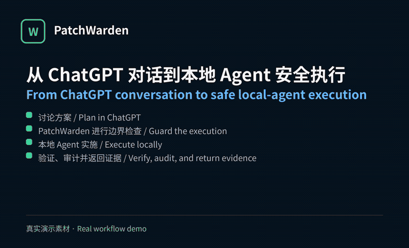

# PatchWarden

<p align="right">
  <strong>English</strong> · <a href="./README.md">简体中文</a>
</p>

[](https://github.com/jiezeng2004-design/PatchWarden/releases/latest)
[](https://nodejs.org/)
[](https://github.com/jiezeng2004-design/PatchWarden/releases/latest)
[](LICENSE)

**Turn an approved ChatGPT plan into workspace-scoped local work, then get verification and audit evidence back.**

PatchWarden connects ChatGPT to a local coding agent such as Codex CLI, Claude Code, or OpenCode. It keeps the agent inside a dedicated workspace, runs only configured verification commands, and records what changed. It is a guarded task bridge, not a general remote shell.

[Download the latest Windows release](https://github.com/jiezeng2004-design/PatchWarden/releases/latest) · [5-minute start](#5-minute-quick-start) · [Connect ChatGPT](#connect-chatgpt-with-secure-mcp-tunnel) · [Troubleshooting](#troubleshooting)

<p align="center">
  
</p>

<p align="center"><sub>53-second real workflow demo. Sensitive keys, tunnel IDs, and account identifiers are masked.</sub></p>

> [!NOTE]
> This guide was validated against **PatchWarden v1.6.7** on 2026-07-28. Use the stable [latest release](https://github.com/jiezeng2004-design/PatchWarden/releases/latest) link for downloads.

## What you get

- **A narrow execution boundary:** tasks stay under the configured `workspaceRoot`.
- **Controlled execution:** the agent is selected from local configuration, and verification commands must match `allowedTestCommands`.
- **Evidence, not just a summary:** task status, changed files, verification, audit, and lineage remain inspectable.

## Before you start

For the first local health check:

- Windows 10 or 11 x64.
- A dedicated folder that contains only the projects PatchWarden may access.
- At least one installed and signed-in local agent: Codex CLI, Claude Code, or OpenCode.
- Node.js 18 or newer for source/npm workflows. Git is recommended for reliable diffs.

To connect ChatGPT later, you also need:

- A ChatGPT account that can add custom Apps/Plugins in Developer mode.
- OpenAI organization access with **Tunnels Read + Use** permission.
- `tunnel-client.exe`, a Core tunnel, and a dedicated tunnel runtime API key.
- An optional second tunnel if you choose to enable PatchWarden Direct.

## 5-minute quick start

This path proves that PatchWarden, your workspace, and a local agent are ready. It deliberately leaves Tunnel and Direct setup for the next section.

### 1. Download and verify

Open [Releases](https://github.com/jiezeng2004-design/PatchWarden/releases/latest) and download the Windows x64 assets listed on the current release page:

- `PatchWarden-Setup-<release-version>-x64.exe` for the installer.
- `PatchWarden-Portable-<release-version>-x64.zip` for the portable build.
- `PatchWarden-Desktop-SHA256SUMS.txt` for checksum verification.

In a folder containing only the current installer, run this PowerShell command and compare its SHA-256 with the checksum file from the same release:

```powershell
Get-FileHash .\PatchWarden-Setup-*-x64.exe -Algorithm SHA256
```

> [!WARNING]
> The current Windows installer is not code-signed, so Microsoft Defender SmartScreen may show an unknown-publisher warning. Verify the SHA-256 checksum against the file from the same GitHub Release before continuing.

### 2. Check the local tools

```powershell
node -v
npm.cmd -v
git --version
where.exe codex
where.exe opencode
```

You need only one working coding agent. A `codex` result that points only to a WindowsApps desktop executable may not be the Codex CLI that PatchWarden can invoke.

### 3. Choose a safe workspace

Open PatchWarden Desktop. For the quickest local check, choose **Local MCP**. Choose **ChatGPT Tunnel** instead if you are ready to continue directly to the next section.

Select a dedicated project folder. Do not use a drive root, your home folder, Desktop, Downloads, or Documents.

### 4. Detect an agent

Open **Settings → Local agents and models**. At least one agent must be available. Keeping the model set to **Follow agent default** is fine.

If an agent is detected but not ready, run its CLI in a separate PowerShell window and finish sign-in or model setup. Then return to PatchWarden and select **Detect again**.

### 5. Confirm the healthy state

Open **Getting Started**. The **Workspace and Agent** and **Core service** checks should be ready. If they are not, open **Advanced Console** and select **Start all**.

At this point PatchWarden has a dedicated workspace and a callable local agent. Continue below only if you want to operate it from ChatGPT.

## Connect ChatGPT with Secure MCP Tunnel

### 1. Create the runtime key and tunnel

1. Open [OpenAI organization API keys](https://platform.openai.com/settings/organization/api-keys) and create a dedicated key for PatchWarden. The creating principal needs **Tunnels Read + Use**.
2. Open [OpenAI Tunnels](https://platform.openai.com/settings/organization/tunnels) and create a Core tunnel named `PatchWarden`.
3. Download the supported `tunnel-client` from that page, or use the [latest public tunnel-client release](https://github.com/openai/tunnel-client/releases/latest).
4. Create a second tunnel named `PatchWarden Direct` only if you need the optional Direct tool profile.

> [!IMPORTANT]
> The dedicated runtime key maps to `CONTROL_PLANE_API_KEY`. It is not a normal `OPENAI_API_KEY`. An `OPENAI_ADMIN_KEY` may be used to administer tunnels, but it should not be the long-lived runtime key. Never paste any of these keys into a README, prompt, screenshot, or Git repository.

### 2. Configure PatchWarden

Open **Settings → MCP and Tunnel**:

1. Use **Detect** or **Choose** to locate `tunnel-client.exe`.
2. Select no proxy if you do not need one. If you use a local proxy, enter a credential-free local URL.
3. Under **Core profile**, enter the Core tunnel ID and dedicated runtime key.
4. Select **Configure and verify Core**.
5. Optional: enable **Direct profile**, enter its separate tunnel ID and runtime key, then verify Direct.

Open **Advanced Console** and select **Start all**. Core, Watcher, and Tunnel should become healthy or available. Direct needs to be healthy only when you enabled it.

### 3. Add the ChatGPT App/Plugin

ChatGPT may call this area **Apps**, **Plugins**, or the older **Connectors**.

1. Open [ChatGPT settings](https://chatgpt.com/#settings/Connectors).
2. Open **Developer mode** and enable it. Continue only for your own PatchWarden instance and a workspace you understand.
3. Create the Core entry with the settings below.
4. Optional: create Direct as a separate entry. Do not combine Core and Direct under one name.

| Entry | Name | Connection | Tunnel | Authentication |
| --- | --- | --- | --- | --- |
| Core | `PatchWarden` | Tunnel | Select the Core tunnel | No Auth |
| Optional Direct | `PatchWarden Direct` | Tunnel | Select the Direct tunnel | No Auth |

`No Auth` means the MCP server does not add another OAuth/Bearer layer. The tunnel runtime key remains local in PatchWarden/tunnel-client and must not be entered in ChatGPT's Authentication field.

Keep confirmation prompts enabled, especially for Direct tools and file-modifying actions.

### 4. Run the first connection check

Start a new ChatGPT conversation. If you configured only Core, remove `@PatchWarden Direct` and the Direct fields from this prompt.

```text
@PatchWarden @PatchWarden Direct

Call, in order:
1. health_check
2. list_agents

Return server_version, watcher.status, the Core/Direct tool_profile and
tool_count, and every agent where invocation_ready=true.
Do not modify any files.
```

The connection is ready when:

- `watcher.status` is healthy.
- The reported `server_version` matches the version you installed.
- `catalog_consistent` is true when returned.
- At least one agent has `invocation_ready=true`.
- No fixed `tool_count` is required; compare it with the active version and profile.

## Run your first auditable demo

Use a disposable demo repository, keep confirmation prompts on, and name the allowed directory and files explicitly.

```text
@PatchWarden @PatchWarden Direct

Run one auditable task in my demo repository:
- First call health_check and list_agents.
- Work only inside the Demo directory I specify.
- Use a local agent where invocation_ready=true.
- Modify only the files I explicitly allow.
- Inspect package.json and run only a verification script that actually exists.
  If no suitable script exists, stop and report that instead of inventing one.
- Do not commit, push, tag, publish, release, or deploy.
- Return request_id, task_id, lineage_id, a diff summary, verification,
  audit, and the final lineage state.
- Use PatchWarden Direct only for read-only independent verification.
```

If Direct is not enabled, remove its mention. Core can still run the guarded task workflow.

## Verify the result

Do not accept only the agent's natural-language summary. Check the task and audit evidence:

| Field | What it means | Expected result |
| --- | --- | --- |
| `task_id` / `lineage_id` | Unique task and workflow records | Present |
| `done_by_agent` | The agent process finished; this is not audit approval | Informational |
| `verification` | Independent configured command checks | Passed |
| `changed_files_total` | Number of files actually changed | Matches the approved scope |
| `out_of_scope_changes_total` | Changes outside the approved scope | `0` |
| `audit` | Independent acceptance decision | `ACCEPTED` |
| final lineage state | End-to-end workflow outcome | `accepted` |

For a read-only smoke test, `changed_files_total` should also be `0`.

## Troubleshooting

### Watcher heartbeat is stale

Select **Start all** in Advanced Console. If the state remains stale, select **Restart all** and wait for healthy status. Do not force-kill an unknown PID.

### ChatGPT still shows old tools after an update

Refresh both `PatchWarden` and `PatchWarden Direct` in their ChatGPT detail pages, then start a new conversation. Call `health_check` and compare `server_version`, `tool_profile`, `tool_count`, `catalog_consistent`, and `tool_manifest_sha256`.

### The tunnel does not appear in ChatGPT

- Confirm that the tunnel was created in the correct organization/workspace scope.
- Confirm that the runtime-key principal has **Tunnels Read + Use**.
- Confirm that `tunnel-client` and PatchWarden services are still running and healthy.
- A new tunnel may need a short propagation period; refresh the plugin creation page.

### An agent appears available but a task fails

Run the agent CLI directly and confirm sign-in and model configuration. Select **Detect again** in PatchWarden, then inspect `failure_reason`, `provider_error_reference`, and the runtime logs.

### ChatGPT asks for plugin authentication

For the tunnel setup documented here, choose **No Auth**. Do not enter `CONTROL_PLANE_API_KEY` in the plugin Authentication field.

## Safety rules

- Never publish API keys, tokens, cookies, `.env` files, SSH keys, or Authorization headers.
- Keep `workspaceRoot` narrow. Do not point it at a drive root or a personal catch-all folder.
- Mask tunnel IDs, app IDs, version IDs, usernames, private repository names, and organization identifiers in public screenshots when appropriate.
- Use a demo repository for the first modifying task.
- Explicitly state allowed files, real verification commands, and forbidden actions.
- Do not automate commit, push, tag, publish, release, or deployment in a first-run demo.
- Treat Direct as an advanced capability and keep human confirmation enabled.

## Run from source (developers)

The desktop release is the shortest path for beginners. For development, these commands match the repository's current Windows PowerShell workflow:

```powershell
git clone https://github.com/jiezeng2004-design/PatchWarden.git
cd .\PatchWarden
npm.cmd ci
npm.cmd run build
Copy-Item .\examples\config.example.json .\patchwarden.config.json
```

Edit `patchwarden.config.json` and set at least `workspaceRoot`, `agents`, and `allowedTestCommands`. Keep this local configuration out of Git.

```powershell
$env:PATCHWARDEN_CONFIG = (Resolve-Path .\patchwarden.config.json)
npm.cmd run doctor
npm.cmd run watch
```

Keep the Watcher window running while using the MCP server.

## Official links

- [PatchWarden repository](https://github.com/jiezeng2004-design/PatchWarden)
- [Latest PatchWarden release](https://github.com/jiezeng2004-design/PatchWarden/releases/latest)
- [PatchWarden tutorial site](https://patchwarden-showcase-redesign.yistart.chatgpt.site/)
- [OpenAI Tunnels](https://platform.openai.com/settings/organization/tunnels)
- [OpenAI organization API keys](https://platform.openai.com/settings/organization/api-keys)
- [Latest public tunnel-client release](https://github.com/openai/tunnel-client/releases/latest)
- [Official tunnel-client end-user guide](https://github.com/openai/tunnel-client/blob/master/docs/end-user-guide.md)
- [ChatGPT Apps/Plugins settings](https://chatgpt.com/#settings/Connectors)
- [Security policy](SECURITY.md) · [Changelog](CHANGELOG.md) · [Contributing](CONTRIBUTING.md)

After an upgrade, always refresh both ChatGPT entries, open a new conversation, and run `health_check` before starting a modifying task.
