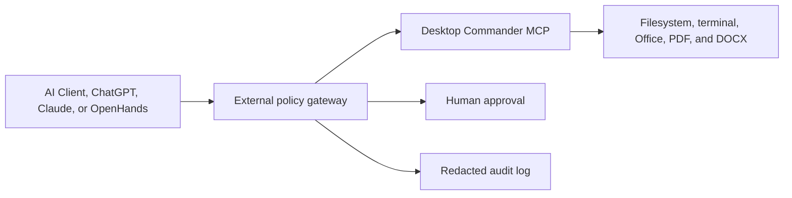

# External Policy Gateway for Desktop Commander

Status checked 2026-07-28: PR [#611](https://github.com/wonderwhy-er/DesktopCommanderMCP/pull/611)
is open and ready for review. It is not merged and is not an accepted or
official integration.

Target: [wonderwhy-er/DesktopCommanderMCP](https://github.com/wonderwhy-er/DesktopCommanderMCP)

Related upstream discussion: [Issue #431](https://github.com/wonderwhy-er/DesktopCommanderMCP/issues/431).
The proposed documentation is a vendor-neutral boundary explanation, not a
claim that the product-level enforcement request in that issue is implemented.

Desktop Commander is a privileged local automation tool. It can read and write
files, execute terminal commands, and work with local document formats. Its
security policy correctly describes built-in restrictions as safety guardrails,
not a sandbox. Strong containment still requires Docker, a VM, a devcontainer,
or another OS-level isolation boundary.

An external policy gateway can add a separate decision and approval layer
between an AI client and Desktop Commander:

The generic term "external policy gateway" should be primary in upstream
documentation. PatchWarden is only one optional example of this pattern.

## Operations Worth Gating

- file deletion and directory removal
- bulk rewrites or multi-file replacement
- reads from sensitive or user-private directories
- shell and interpreter execution
- local or global package installation
- Git push, force push, tags, and releases
- outbound network calls
- writes to Office, PDF, or DOCX files

A gateway can normalize the requested operation, apply workspace and path
rules, evaluate dynamic risk, request human approval, and record the decision
before forwarding an allowed call.

## Boundary and Limitations

This pattern governs only calls routed through the gateway. If the AI client
connects directly to Desktop Commander, uses a native shell/filesystem tool,
or reaches another MCP server, the external gateway cannot intercept that
operation. Client configuration or hooks must prevent bypass when the policy
boundary is intended to be mandatory.

The gateway is also not a substitute for Desktop Commander's own guardrails or
OS isolation. Defense in depth can combine all three:

1. OS or container isolation limits reachable resources.
2. Desktop Commander guardrails reduce unsafe direct operations.
3. The external gateway decides whether a routed operation should execute and
   preserves approval/audit evidence.

## Pull Request Draft

Title:

> docs(security): document external policy gateway pattern

Description:

> Document a vendor-neutral external policy gateway pattern for deployments
> that need pre-execution risk decisions, human approval, and audit records in
> addition to Desktop Commander's existing guardrails. The documentation keeps
> Docker/VM isolation as the strong security boundary, explicitly states that
> bypassed calls are not governed, and lists PatchWarden only as an optional
> example rather than a required or official integration.

## Test Plan Draft

- Render the Markdown and Mermaid diagram on GitHub.
- Verify all links against the current security policy and installation docs.
- Check that the text never describes allowed directories or command blocking
  as a sandbox.
- Check that the bypass limitation is visible next to the architecture.
