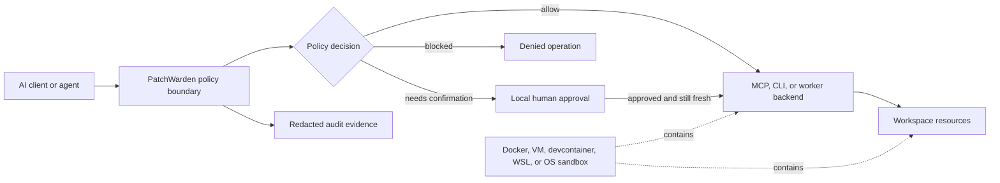

# PatchWarden Security Model

PatchWarden is a local-first policy, risk-assessment, approval, audit, and
workspace-protection layer for AI coding workflows. It is not a sandbox.

PatchWarden reduces the chance that an agent mistake becomes an unsafe local
action. It does not provide process, kernel, network, or tenant isolation. Use
Docker, a virtual machine, a devcontainer, an appropriately isolated WSL
environment, or an operating-system sandbox when strong containment is
required.

For the implementation-level invariants and review checklist, see the
[PatchWarden threat model](threat-model.md).

## Security Goals

PatchWarden is designed to reduce:

- accidental file deletion, unintended bulk edits, and out-of-scope writes
- dangerous or hallucinated commands proposed by an agent
- prompt-injection attempts that ask an agent to bypass local policy
- accidental Git pushes, force pushes, tags, releases, or publishing actions
- credential exposure through sensitive paths, task evidence, or tool arguments
- unreviewed high-risk MCP and CLI operations

The primary threats are accidental damage, prompt-injection-driven actions,
and unsafe commands caused by incorrect agent reasoning. PatchWarden does not
claim to contain a fully malicious local user, an attacker with operating-system
privileges, or a compromised process that can bypass PatchWarden entirely.

## Enforcement Boundary

PatchWarden can govern only operations routed through its MCP tools, task
workflow, Direct tools, or an integration that explicitly calls its policy
boundary. A client-native shell, filesystem tool, browser, or MCP connection
that bypasses PatchWarden is outside this enforcement boundary.

For broader coverage, combine PatchWarden with one or more of:

- client hooks that route or deny native high-risk tools
- an MCP proxy or explicit policy-gateway adapter
- a shell or generated-CLI wrapper
- an external gateway in front of a privileged tool such as Desktop Commander
- Docker, a VM, a devcontainer, WSL isolation, or an OS-level sandbox

The containment layer and the policy layer solve different problems:
containment limits what a process can reach, while policy decides whether a
reachable action should be performed.

## Integration Risk Vocabulary

The following vocabulary is recommended for integrations and design documents:

| Risk level | Default handling | Typical examples |
| --- | --- | --- |
| Low | Execute and record | Bounded read-only inspection and exact allowlisted checks |
| Medium | Require explicit user confirmation | Scoped writes, controlled local package changes, or MCP sampling with reviewed context |
| High | Block by default | File deletion, unknown shell commands, Git push, or broad writes |
| Critical | Prohibit unless policy is explicitly changed by a trusted local maintainer | Force push, credential access, out-of-workspace writes, or exfiltration-like commands |

This four-level vocabulary is an integration recommendation, not the current
runtime wire contract. PatchWarden v1.6.6 emits `low`, `medium`, or `high`, with
decisions `allow`, `needs_confirm`, or `blocked`. Operations that an integration
would call Critical are currently represented by hard-rule hits that produce
`high` plus `blocked`; the runtime does not emit a literal `critical` value.

Medium-risk confirmation is local-only. `patchwarden-confirm` is deliberately
not exposed as an MCP tool, so a remote caller cannot approve its own ticket.

## Recommended Audit Event

An integration-facing audit event should be correlatable without retaining raw
tool arguments. Recommended fields are:

| Field | Purpose |
| --- | --- |
| `agent_id` | Stable identity of the requesting agent or client |
| `workspace` | Canonical governed workspace identifier |
| `tool_name` | Requested tool or wrapped command name |
| `operation_type` | Normalized class such as read, write, delete, command, network, or sampling |
| `args_hash` | Digest of canonicalized arguments; never the raw secret-bearing arguments |
| `risk_level` | Integration risk classification |
| `decision` | Allow, require confirmation, or block outcome |
| `reason` | Stable reason code plus bounded human-readable context |
| `snapshot_id` | Repository or policy snapshot correlated with the decision |
| `timestamp` | UTC event time |
| `user_confirmation_id` | Correlation identifier for a local approval, when applicable |

PatchWarden does not currently emit all of these fields in one record. Its
invocation log uses `arguments_digest` for the proposed `args_hash`, and also
records fields including `toolName`, `risk`, `profile`, `result`, `error_code`,
and `duration_ms`. Assessment records separately contain the agent, repository,
risk decision, workspace fingerprint, snapshot summary, and local confirmation
metadata. `snapshot_id` and `user_confirmation_id` are recommended normalized
integration fields, not current unified log keys.

## Operational Guidance

- Keep `workspaceRoot` narrow and dedicated to source repositories.
- Register agent commands locally; never accept an arbitrary launch command
  from model input.
- Use exact verification-command allowlists and repository policy reviewed by
  a maintainer.
- Keep `.env`, tokens, SSH material, browser state, and credential stores out
  of task inputs and evidence.
- Review structured evidence before accepting a task; completion is not the
  same as successful verification.
- Verify GitHub, npm, tags, releases, and other remote facts against their
  authoritative services.

## Related Work

- [Runtime Guard](https://github.com/runtimeguard/runtime-guard) demonstrates
  runtime policy, approvals, backups, workspace boundaries, and audit logs.
- [Desktop Commander MCP](https://github.com/wonderwhy-er/DesktopCommanderMCP)
  documents why privileged local automation guardrails are not a sandbox.
- [Snyk Agent Scan](https://github.com/snyk/agent-scan) scans agents, MCP
  servers, and skills with explicit consent before starting stdio servers.
- [StepSecurity Dev Machine Guard](https://github.com/step-security/dev-machine-guard)
  inventories AI tools and developer-machine risk.
- [MCPorter](https://github.com/openclaw/mcporter),
  [mcp-agent](https://github.com/lastmile-ai/mcp-agent), and
  [OpenHands](https://github.com/OpenHands/OpenHands/issues/15377) provide
  useful integration points for generated CLIs, agent frameworks, and action
  governance.
